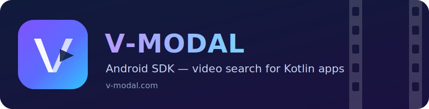
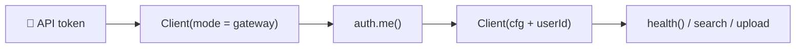
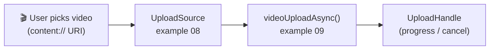

<div align="center">



<br/><br/>

**Search video with plain text from your Kotlin Android app.**
No video-processing stack, no vector database — just a client, a token, and coroutines.

[](https://kotlinlang.org)
[](https://developer.android.com)
[](https://adoptium.net)
[](https://kotlinlang.org/docs/coroutines-overview.html)
[](https://v-modal.com)

[Quick start](#-quick-start) •
[Search](#-search-a-collection) •
[Upload](#-upload-a-video) •
[Examples](examples/01_starter/) •
[Search app](docs/search_app.md) •
[API reference](DOC_REF.md) •
[Troubleshooting](#-troubleshooting)

</div>

---

## ✨ What you can do

```kotlin
val result = sdk.searches.searchVideo(
    queryText = "red car at night",   // describe the moment in plain words
    groupName = "traffic-cameras",    // your collection
    streamName = "astream",
    limit = 20,
)
```

That is the whole idea: upload videos into collections, then find moments in
them with natural language. The SDK also manages collections, uploads large
files with resumable multipart streaming, and plays nicely with
`Dispatchers.IO`, `lifecycleScope`, and WorkManager.

> The SDK is currently added from this repository's source code. It is not yet
> published to a Maven repository.

## 📋 What you need

| Requirement | Details |
|---|---|
|  Kotlin project | Android project using Gradle Kotlin DSL |
| ☕ Java 17 | `sourceCompatibility` / `jvmTarget = "17"` |
| 📦 This repository | Checked out next to, or inside, your Android project |
| 🔑 API token | From your application's approved sign-in flow |

> ⚠️ Do not put a real token in source control. Pass it to the client at runtime.

## 🚀 Quick start

Three steps from zero to your first API response.

### 1️⃣ Add the SDK project

Open your Android project's `settings.gradle.kts` and add:

```kotlin
include(":vmodal-sdk-android")
project(":vmodal-sdk-android").projectDir =
    file("../vmx_api/uinterface/sdk_android")
```

The path passed to `file(...)` is relative to `settings.gradle.kts`. Change it
if your repository is in a different location.

In the same file, make sure `dependencyResolutionManagement.repositories`
contains `mavenCentral()`:

```kotlin
dependencyResolutionManagement {
    repositories {
        mavenCentral()
    }
}
```

### 2️⃣ Configure your app module

In the app module's `build.gradle.kts`, use Java 17 and add the SDK dependency:

```kotlin
android {
    compileOptions {
        sourceCompatibility = JavaVersion.VERSION_17
        targetCompatibility = JavaVersion.VERSION_17
    }
    kotlinOptions {
        jvmTarget = "17"
    }
}

dependencies {
    implementation(project(":vmodal-sdk-android"))
}
```

Sync the Gradle project, then allow network access in
`app/src/main/AndroidManifest.xml` (directly inside `<manifest>`):

```xml
<uses-permission android:name="android.permission.INTERNET" />
```

### 3️⃣ Connect and print the API status

V-Modal calls perform network I/O. Run them from `Dispatchers.IO`, WorkManager,
or another worker thread — never the Android main thread.

The following function authenticates the token, creates the ready-to-use
client, and returns the first visible result:

```kotlin
import com.vmodal.sdk.Client
import com.vmodal.sdk.PUBLIC_GATEWAY_URL
import kotlinx.coroutines.Dispatchers
import kotlinx.coroutines.withContext

suspend fun checkVmodal(apiToken: String): Client = withContext(Dispatchers.IO) {
    val firstClient = Client(
        baseUrl = PUBLIC_GATEWAY_URL,
        token = apiToken,
        mode = "gateway",
    )
    val me = firstClient.auth.me()

    val sdk = Client(
        firstClient.cfg.copy(
            userId = requireNotNull(me.userId),
            tenantId = me.tenantId.orEmpty(),
            email = me.email.orEmpty(),
        )
    )

    val health = sdk.health()
    println("VModal connected: ${health.status}")
    sdk
}
```

Call it from an Activity or Fragment lifecycle scope:

```kotlin
import androidx.lifecycle.lifecycleScope
import kotlinx.coroutines.launch

lifecycleScope.launch {
    val sdk = checkVmodal(apiToken)
    // Keep or pass sdk to the code that needs V-Modal.
}
```

Use `viewModelScope.launch { ... }` instead when the client belongs to a
ViewModel. A printed `VModal connected: ...` message means installation,
authentication, and network access are all working. 🎉

### How the connection works



## 📁 List your collections

Once the quick start works, use the returned `sdk` client on the same worker
context:

```kotlin
val groups = sdk.collections.listGroups(mode = "vid_file")
println("Collections: ${groups.total}")
groups.data.forEach(::println)
```

This is a useful second check because it confirms that the authenticated user
can reach their V-Modal data.

## 🔍 Search a collection

Replace `traffic-cameras` with a collection returned by `listGroups()`:

```kotlin
val result = sdk.searches.searchVideo(
    queryText = "red car at night",
    groupName = "traffic-cameras",
    streamName = "astream",
    limit = 20,
)

println("Matches returned: ${result.cntActual}")
result.data.forEach(::println)
```

> 💡 If the call succeeds but returns no matches, first confirm the collection
> name, stream name, and query text. An empty result is different from an API
> error.

## 📤 Upload a video

After authentication and search work, continue with the upload examples. The
Android-safe path is:



1. Let the user select a video and obtain a `content://` URI.
2. Convert the URI to an `UploadSource` with
   [example 08](examples/01_starter/08_content_uri_source.kt).
3. Start the upload with
   [example 09](examples/01_starter/09_async_video_upload.kt).
4. Keep the returned `UploadHandle` if the UI needs a Cancel action.

The SDK streams the video instead of loading the whole file into memory. Files
of at least 100 MiB use multipart upload by default.

## 🛠️ Troubleshooting

| Symptom | Fix |
|---|---|
| `VMODAL_API_KEY is required` | `Client.fromEnv()` is intended for JVM tools and CI, where environment variables exist. In an Android app, pass the runtime token as shown in the quick start. |
| `auth/me returned no user_id` or auth error | Confirm the token is current and belongs to the environment identified by `PUBLIC_GATEWAY_URL`. Do not invent or hard-code a user ID; `auth.me()` resolves the token owner. |
| `NetworkOnMainThreadException` or frozen UI | Move blocking calls (`auth.me()`, `health()`, `listGroups()`, `searchVideo()`) to `Dispatchers.IO` or WorkManager. `videoUploadAsync()` already runs off the main thread, but its callbacks do too — switch to `Dispatchers.Main` before updating views. |
| Gradle cannot find the SDK project | Check the path in `settings.gradle.kts`. It must point to this exact directory: `uinterface/sdk_android`. |

## ✅ Verify the SDK checkout

These commands test the SDK itself; they are not required each time the Android
app runs:

```bash
cd uinterface/sdk_android
bash install.sh check   # verifies Java and Gradle
bash test.sh all        # offline regression suite + simulated app
```

No emulator or API token required.

## 🗺️ Learn progressively

| Step | Where | What you get |
|---|---|---|
| 1 | This page | Working client, first API response |
| 2 | [Examples](examples/01_starter/) | Copy-paste building blocks, grouped by task |
| 3 | [Upload guide](docs/sdk_doc.md) | Android URI uploads, cancellation, WorkManager, process-death resume |
| 4 | [API quick reference](DOC_REF.md) | Every method and response type |

All typed response objects expose `raw: Map<String, Any?>` for server fields
that do not yet have a typed property. All SDK failures derive from `SdkError`;
applications can handle `AuthError`, `ValidationFailed`, `ApiError`, and
`FeatureDisabled` separately when needed.

---

<div align="center">

&nbsp;&nbsp;
&nbsp;&nbsp;
&nbsp;&nbsp;


Built for Kotlin developers, by [**v-modal.com**](https://v-modal.com) 💜

<sub>Logo attributions in [assets/README.md](assets/README.md).</sub>

</div>
