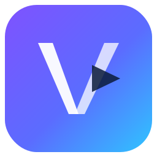

## Prompt to start

```text
Set up and validate the Android application in
`uinterface/sdk_android/examples/03_fullapp/` as a complete Android example for
the local VModal Android SDK.

Before editing, inspect the existing SDK, full-app example, starter snippets,
scripts, tests, and documentation. Reuse the current implementation and improve
it in place; do not replace working components or duplicate SDK logic inside
the example.

Requirements:
- Keep the default Gradle project dependency on the SDK at `../..`; preserve
  the existing optional Maven Local verification path.
- Use Kotlin, Jetpack Compose, coroutines, `StateFlow`, and lifecycle-aware
  state collection with Java 17, compile SDK 34, and minimum SDK 24.
- Provide a simple runnable flow for an API key supplied at runtime: configure
  the client, call `auth.me()`, list video collections, upload a selected
  `content://` URI or bundled sample with progress and cancellation,
  create/check an image index, search the selected collection, resolve result
  images in one bulk request, and display them in a responsive grid.
- Use the coroutine facade from caller-owned scopes and collect UI state with
  lifecycle awareness; do not hard-code a main dispatcher inside SDK calls.
  Keep collection, stream, index-job, search-hit, and resolved-image contracts
  explicitly coupled so data from one scope cannot appear under another.
- Keep credentials in memory only. Never hard-code, persist, print, or commit
  API keys, bearer tokens, or presigned URLs. Do not attach the VModal bearer
  token when loading presigned image URLs.
- Use Android's Storage Access Framework for user-selected videos; do not add
  broad storage permissions or depend on device filesystem paths.
- Keep the example beginner-friendly and small. Use the public typed SDK API,
  preserve request/response contracts, handle loading, empty, error, and
  cleanup states, and cancel/clear SDK resources when the ViewModel is cleared
  or the authenticated identity changes.
- Update `examples/03_fullapp/README.md` when setup steps or behavior change.
- Use the repository scripts and pinned Gradle/JDK setup. Do not create another
  environment or replace the reviewed Gradle wrapper.

From `uinterface/sdk_android`, verify the SDK with:

  bash install.sh check
  bash test.sh test
  bash run.sh sim

Then verify the full app with:

  cd examples/03_fullapp
  ./gradlew --no-daemon :app:testDebugUnitTest :app:assembleDebug

With an unlocked API 24+ emulator or device available, also run
`./gradlew --no-daemon :app:connectedDebugAndroidTest`. Report the files
changed, validation results, and any device or platform check that could not be
run with the exact blocker. Do not claim a live API flow passed unless it was
tested with a valid runtime key.
```

<div align="center">
  
  &nbsp;&nbsp;&nbsp;&nbsp;
  
  <h1>VModal for Android</h1>
  <p><strong>Give your Android app a multimodal memory.</strong></p>
  <p>Upload video. Find moments by meaning, speech, text, or imagery.<br>Build the experience in Kotlin, Compose, Views, coroutines, and the Android tools you already know.</p>
  
  
  
  
  
  <a href="https://github.com/arita37/vmx_api/actions/workflows/sdk_android_ci.yml"></a>
</div>

<br>


<p align="center"><em>Turn every video library into an experience Android users can explore.</em></p>

## Build the feature people remember

VModal brings multimodal video search and mobile-friendly uploads to Kotlin with a small, typed API. Your app owns the screens and lifecycle; the SDK handles the gateway, request models, response parsing, signed upload streams, progress, and cancellation.

| Your Android experience | VModal gives you |
|---|---|
| “Find the red car entering the parking lot” | Semantic video and image search |
| Search words spoken or shown on screen | ASR and OCR search sources |
| Upload from the system photo picker | Streaming `content://` URI support |
| A cancel action that really cancels | Cold upload Flow plus callback `UploadHandle` compatibility |
| Compose, Views, or your own design system | A UI-free Kotlin client |
| Existing authentication and DI | App-owned runtime credentials—no login UI imposed |
| Work that survives beyond one screen | `CoroutineWorker` plus cancellation-aware upload Flow |

Start with the [Android integration cookbook](docs/android_integration_cookbook.md)
for the capability map, one coupled upload → index → search recipe, Compose and
classic lifecycle patterns, `content://`, WorkManager, typed failures, and
account-switch cleanup. Demo UI remains application-owned: the SDK publishes no
navigation, screens, themes, accessibility policy, or design system.

> [!TIP]
> **Building a mobile video experience?** [Get a free beta API key](https://v-modal.com/page/contact.ts) and join the [VModal Discord](https://discord.gg/CRNsdJHg6). 

[SDK docs: v-modal.github.io/vmodal_sdk_android/](https://v-modal.github.io/vmodal_sdk_android/)
    
We would love to help you ship it.

## Kotlin SDK reference

Browse the generated [Kotlin SDK reference](https://v-modal.github.io/vmodal_sdk_android/) for public
classes, constructors, properties, extension functions, and methods. KDoc beside
the Kotlin declarations is the content authority. The published reference
intentionally omits service hosts, endpoint paths, route tables, and
implementation source; route synchronization is checked by a separate
regression tool.

Network diagnostics are disabled by default. For opt-in, SDK-sanitized request-start, response,
failure, retry, timing, and signed-upload events—including a small Android Logcat binding—see the
[redacted network diagnostics guide](docs/network_diagnostics.md). There is no unredacted mode, and
uploaded bytes, raw URLs, credentials, headers, bodies, and exception messages never reach the sink.

## Start in minutes

For new content flows, the preferred API binds every upload, search, asset,
index, and deletion call to one immutable project/collection/stream scope:

```kotlin
import com.vmodal.sdk.VModal

val content = VModal.configure(
    projectId = "food_app",
    apiKey = apiKeyLoadedByYourApp,
).scope(
    collectionName = "user_123",
    streamName = "uploads",
)

val results = content.search("the cyclist crossing the bridge at sunset")
```

Use the lower-level `Client` API for authentication, administration, images,
R2, and advanced operations not yet represented by the scoped facade.

### 1. Add the SDK

The release coordinate is:

```kotlin
dependencies {
    implementation("com.vmodal:vmodal-sdk-android:1.0.0")
}
```

Keep `mavenCentral()` in `dependencyResolutionManagement`. Maven Central publication is still pending, so current adopters should clone the [public SDK repository](https://github.com/v-modal/vmodal_sdk_android) beside their app and include the source project:

```kotlin
// settings.gradle.kts
include(":vmodal-sdk-android")
project(":vmodal-sdk-android").projectDir = file("../vmodal_sdk_android")
```

```kotlin
// app/build.gradle.kts
dependencies {
    implementation(project(":vmodal-sdk-android"))
}
```

The project uses Java 17. Your app also needs network permission:

```xml
<uses-permission android:name="android.permission.INTERNET" />
```

### 2. Connect with your runtime API key

Load the key through your app's authenticated backend or secure, app-owned storage. Never bundle a real key in `BuildConfig`, resources, the manifest, or source control.

```kotlin
import com.vmodal.sdk.Client
import com.vmodal.sdk.MutableApiKeyProvider
import com.vmodal.sdk.SdkConfig

val keys = MutableApiKeyProvider(apiKeyLoadedByYourApp)

val bootstrap = Client(SdkConfig(apiKeyProvider = keys))
val me = bootstrap.coroutines().auth.me()

val vmodal = Client(
    bootstrap.cfg.copy(
        userId = requireNotNull(me.userId),
        tenantId = me.tenantId.orEmpty(),
        email = me.email.orEmpty(),
    )
)
```

Keep `keys` and `vmodal` at application or authenticated-session scope so Activities, ViewModels, and workers share the same identity and key rotations.

## Search video from a ViewModel

The coroutine facade is preferred for new Kotlin code. The ViewModel owns the
scope; the SDK owns no lifecycle or UI dispatcher:

```kotlin
viewModelScope.launch {
    val api = vmodal.coroutines()
    val groups = api.collections.listGroups("vid_file")
    val group = groups.findGroup("travel-diaries", "vid_file")
        ?: error("Collection is not available for this API key")
    val version = group.latestLancedbVersion
        ?: error("Collection has no searchable LanceDB version")

    val results = api.searches.searchVideo(
        queryText = "the cyclist crossing the bridge at sunset",
        groupName = group.groupName,
        streamName = "astream",
        searchSources = listOf("ocr", "asr", "image"),
        limit = 20,
        versionLancedb = version,
    )

    println("${results.cntActual} moments found")
    results.data.forEach(::println)
}
```

Search collection names are scoped to the authenticated runtime key. Use a
`vid_file` `GroupItem` returned by `listGroups()`, and send its
`latestLancedbVersion`; omitting the advertised version can target the wrong
index or an unavailable default.

The response stays typed where the contract is stable and preserves `raw: Map<String, Any?>` so new server fields remain available immediately.

## Upload from an Android picker

Convert the selected `content://` URI into a reopenable `UploadSource` using the [`ContentResolver` adapter](examples/01_starter/src/main/kotlin/com/vmodal/sdk/examples/ContentUriUploadSource.kt), then collect one signed upload:

```kotlin
import com.vmodal.sdk.VideoUploadEvent

val source = contentUriSource(
    context = applicationContext,
    uri = selectedVideoUri,
    fileName = "weekend-ride.mp4",
)

vmodal.coroutines().collections.videoUploadEvents(
    source = source,
    collectionName = "travel-diaries",
    subCollectionName = "mobile-uploads",
).collect { event ->
    when (event) {
        is VideoUploadEvent.Progress -> println("Uploading ${event.progress.percent}%")
        is VideoUploadEvent.Completed -> println("Ready: ${event.response.destPath}")
    }
}
```

The Flow is cold: every collection starts a new upload. Collect once in a
caller-owned scope. If multiple consumers need one operation, share app state
with `stateIn`, `shareIn`, or a repository `StateFlow`. Cancelling collection
cancels the upload. The SDK streams the video instead of loading it into memory.

Existing integrations may keep `videoUploadAsync()` and its `UploadHandle`, or
the blocking `videoUpload()` on a worker thread, while migrating one operation
at a time.

Signed single upload is the production default for every file size. Multipart upload is experimental and must be enabled explicitly with `VideoUploadOptions(multipart = true)`; it fails with `FeatureDisabled` when the gateway does not expose the complete multipart route family.

## Made for Android lifecycles

- Use `Client.coroutines()` from `viewModelScope` or `lifecycleScope` for new Kotlin search and collection operations.
- Collect UI state with lifecycle awareness (`collectAsStateWithLifecycle` or `repeatOnLifecycle`).
- Feed picker results through `ContentResolver` without copying the whole file into memory.
- Collect `videoUploadEvents()` once for UI-driven uploads; collector cancellation reaches the upload handle.
- Use `CoroutineWorker` for durable uploads. Never retry cancellation, and bound retries to transient failures.
- Keep callback `videoUploadAsync()` and blocking `videoUpload()` for existing consumers during migration.
- Keep the SDK UI-free: Jetpack Compose and classic Views are both first-class consumers.
- Rotate a same-user credential without rebuilding the client: `keys.rotate(freshKey)`.
- On logout or account switch, cancel work, clear upload persistence, call `keys.clear()`, and build a new client for the next identity.

## One client, focused resources

```text
vmodal.auth          identity and health
vmodal.searches      multimodal video search
vmodal.collections   upload and collection lifecycle
vmodal.indexes       create, inspect, and delete indexes
vmodal.admin         usage and cache statistics
vmodal.r2            presigned object-storage operations
vmodal.images        image retrieval
```

All SDK failures derive from `SdkError`. Apps can handle `AuthError`, `ValidationFailed`, `ApiError`, `FeatureDisabled`, `TransportError`, `ResponseTooLarge`, and `MalformedResponse` separately.

## Security and network behavior

Gateway mode is the default. It sends caller identity only through `Authorization: Bearer <key>` and ignores caller-supplied identity headers. `Client.unsafeDirect(...)` is reserved for trusted private networks whose downstream service independently authenticates identity.

- `GET` and `HEAD` may retry recognized transient failures; mutations are sent once.
- Authenticated calls require HTTPS, except literal loopback hosts used for development.
- Redirects are not followed.
- JSON/text responses are bounded to 8 MiB, errors to 1 MiB, and binary responses to 64 MiB.
- Presigned uploads never receive the VModal bearer credential or identity headers.

Releases use a **minimal release security** profile with one blocking security
job: candidate-tree verified-secret detection. Normal SDK tests, route sync,
authenticated live tests, clean consumers, version/license checks, and tested-
artifact checksums remain blocking correctness gates. OSV/SBOM generation,
full-history scanning, strict dependency-verification metadata, wrapper-JAR
shell hashing, and compiled route-string scans are preserved but inactive. The
profile therefore does not claim a complete dependency or supply-chain audit;
see the [Maven Central release guide](docs/maven_release.md) for residual risks.

For the complete contract, read [SDK behavior and uploads](docs/sdk_doc.md) and [runtime API-key management](docs/manage_api_key.md).

## Android toolchain

| Component | Reference configuration |
|---|---:|
| Kotlin | `1.9.24` |
| Java / JVM target | `17` |
| Gradle | `8.6` |
| Android Gradle Plugin | `8.4.2` |
| Reference app `minSdk` | API 24 / Android 7.0 |
| Reference app `compileSdk` | API 34 |

The core artifact deliberately avoids Android framework dependencies, which keeps it JVM-testable. The included Android reference app demonstrates Compose, `content://` uploads, lifecycle scopes, and source-project consumption.

Gradle 8.6 is the supported build version and is pinned by the checked-in root
wrapper. Use `./gradlew` for root builds and Android Studio imports; an installed
system Gradle, including Gradle 9, is not part of the supported toolchain.

## Explore the SDK

- [Run the staged full search application](examples/03_fullapp/)
- [Run the Android upload → index → search app](examples/02_search/)
- [Copy the Kotlin starter examples](examples/01_starter/)
- [Read the upload and WorkManager guide](docs/sdk_doc.md)
- [Use coroutines and upload Flow](docs/coroutines.md)
- [Follow the Android integration cookbook](docs/android_integration_cookbook.md)
- [Manage API keys safely](docs/manage_api_key.md)
- [Build the complete upload → index → search experience](docs/search_app.md)
- [Browse the API quick reference](DOC_REF.md)
- [Open an issue](https://github.com/v-modal/vmodal_sdk_android/issues)

## Development

```bash
git clone https://github.com/v-modal/vmodal_sdk_android.git
cd vmodal_sdk_android
./gradlew --no-daemon help
bash install.sh check
bash test.sh ci
bash test.sh all
```

Build the included Android app against the source checkout:

```bash
cd examples/02_search
./gradlew --no-daemon :app:assembleDebug
```

`bash test.sh ci` reproduces the read-only pull-request gates with an isolated,
checksummed Maven artifact, a clean standalone consumer, and both demo builds.
No emulator or API credential is required. Maintainers can follow the
[Maven Central release guide](docs/maven_release.md).

---

<div align="center">
  
  &nbsp;&nbsp;
  
  &nbsp;&nbsp;
  
  &nbsp;&nbsp;
  
  <p><strong>Build video experiences people can search, not just scroll.</strong></p>
  <sub>Built for Android developers by <a href="https://v-modal.com">VModal</a>. Licensed under the <a href="LICENSE">Apache License 2.0</a>.</sub>
  <br>
  <sub>Android and the Android robot are trademarks of Google LLC. Asset attribution is documented in <a href="assets/README.md">assets/README.md</a>.</sub>
</div>
