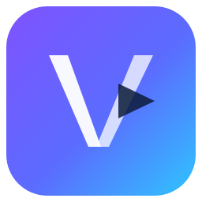

<div align="center">
  
  &nbsp;&nbsp;&nbsp;&nbsp;
  
  <h1>VModal for Android</h1>
  <p><strong>Give your Android app a Visual Memory (Video, Audio,..)</strong></p>
  <p>Upload video. Find moments by meaning, speech, text, or imagery.<br>Build the experience in Kotlin, Compose, Views, coroutines, and the Android tools you already know.</p>
  
  
  
  
  
  <a href="https://github.com/arita37/vmx_api/actions/workflows/sdk_android_ci.yml"></a>


</div>

<br>


<p align="center"><em>Turn every video library into an experience Android users can explore.</em></p>

[V-Modal AI Discord](https://discord.gg/CRNsdJHg6) <br>
[V-Modal AI Website](https://www.v-modal.com/developers)


<details>
<summary><strong>Build the feature people remember</strong></summary>

V-Modal AI brings multimodal video search and mobile-friendly uploads to Kotlin with a small, typed API. Your app owns the screens and lifecycle; the SDK handles the gateway, request models, response parsing, signed upload streams, progress, and cancellation.

| Your Android experience | VModal gives you |
|---|---|
| “Find the red car entering the parking lot” | Semantic video and image search |
| Search words spoken or shown on screen | ASR and OCR search sources |
| Upload from the system photo picker | Streaming `content://` URI support |
| A cancel action that really cancels | Cold upload Flow plus callback `UploadHandle` compatibility |
| Compose, Views, or your own design system | A UI-free Kotlin client |
| Existing authentication and DI | App-owned runtime credentials—no login UI imposed |
| Work that survives beyond one screen | `CoroutineWorker` plus cancellation-aware upload Flow |

</details>

<details>
<summary><strong>Prompt to start</strong></summary>

Copy this prompt into your coding agent:

```text
Download, install, set up, run, and validate the VModal Android SDK and its
complete demo application.

1. Download the GitHub repository:

     git clone https://github.com/arita37/vmx_api.git
     cd vmx_api

   If the repository already exists, reuse the current checkout and preserve
   unrelated local changes.

2. Install and verify the SDK toolchain:

     cd uinterface/sdk_android
     bash install.sh install
     bash install.sh check

   Use the checked-in Gradle wrapper. Do not create another environment or
   replace the reviewed wrapper.

3. Set up Android:

   - Install Android Studio and Android SDK 34.
   - Use JDK 17.
   - Set ANDROID_HOME or ANDROID_SDK_ROOT when building from the command line.
   - Start an unlocked Android 7.0/API 24+ emulator or connect a device.
   - Supply the VModal API key only at runtime in the demo application. Never
     save it in source, resources, Gradle properties, local.properties, logs,
     or the manifest.

4. Run the complete demo application:

   Open `uinterface/sdk_android/examples/03_fullapp/` in Android Studio, allow
   Gradle to sync, select the `app` run configuration, and run
   **VModal Full Search** on the API 24+ emulator or device.

   Also build and install it from the command line:

     cd examples/03_fullapp
     ./gradlew --no-daemon :app:testDebugUnitTest :app:assembleDebug
     adb devices
     ./gradlew --no-daemon :app:installDebug

Set up and validate `uinterface/sdk_android/examples/03_fullapp/` as a complete
Android example for the local VModal Android SDK.

Before editing, inspect the existing SDK, full-app example, starter snippets,
scripts, tests, and documentation. Reuse the current implementation and improve
it in place; do not replace working components or duplicate SDK logic inside
the example.

Requirements:
- Keep the default Gradle project dependency on the SDK at `../..`; preserve
  the existing optional Maven Local verification path.
- Use Kotlin, Jetpack Compose, coroutines, `StateFlow`, and lifecycle-aware
  state collection with Java 17, compile SDK 34, and minimum SDK 24.
- Provide a simple runnable flow for an API key supplied at runtime: configure
  the client, call `auth.me()`, list video collections, upload a selected
  `content://` URI or bundled sample with progress and cancellation,
  create/check an image index, search the selected collection, resolve result
  images in one bulk request, and display them in a responsive grid.
- Use the coroutine facade from caller-owned scopes and collect UI state with
  lifecycle awareness; do not hard-code a main dispatcher inside SDK calls.
  Keep collection, stream, index-job, search-hit, and resolved-image contracts
  explicitly coupled so data from one scope cannot appear under another.
- Keep credentials in memory only. Never hard-code, persist, print, or commit
  API keys, bearer tokens, or presigned URLs. Do not attach the VModal bearer
  token when loading presigned image URLs.
- Use Android's Storage Access Framework for user-selected videos; do not add
  broad storage permissions or depend on device filesystem paths.
- Keep the example beginner-friendly and small. Use the public typed SDK API,
  preserve request/response contracts, handle loading, empty, error, and
  cleanup states, and cancel/clear SDK resources when the ViewModel is cleared
  or the authenticated identity changes.
- Update `examples/03_fullapp/README.md` when setup steps or behavior change.
- Use the repository scripts and pinned Gradle/JDK setup.

From `uinterface/sdk_android`, verify the SDK with:

  bash install.sh check
  bash test.sh test
  bash run.sh sim

Then verify the full app with:

  cd examples/03_fullapp
  ./gradlew --no-daemon :app:testDebugUnitTest :app:assembleDebug

With an unlocked API 24+ emulator or device available, also run
`./gradlew --no-daemon :app:connectedDebugAndroidTest`. Report the files
changed, validation results, and any device or platform check that could not be
run with the exact blocker. Do not claim a live API flow passed unless it was
tested with a valid runtime key.
```


<details>
<summary><strong>Guidelines</strong></summary>


Start with the [Android integration cookbook](docs/android_integration_cookbook.md)
for the capability map, one coupled upload → index → search recipe, Compose and
classic lifecycle patterns, `content://`, WorkManager, typed failures, and
account-switch cleanup. Demo UI remains application-owned: the SDK publishes no
navigation, screens, themes, accessibility policy, or design system.

> [!TIP]
> **Building a mobile video experience?** [Get a free beta API key](https://v-modal.com/page/contact.ts) and join the [VModal Discord](https://discord.gg/CRNsdJHg6). 

[SDK docs: v-modal.github.io/vmodal_sdk_android/](https://v-modal.github.io/vmodal_sdk_android/)
    
We would love to help you ship it.

</details>

</details>

<details>
<summary><strong>Start building</strong></summary>

For new content flows, bind upload, search, asset, index, and deletion calls to
one immutable project, collection, and stream:

```kotlin
import com.vmodal.sdk.VModal

val content = VModal.configure(
    projectId = "food_app",
    apiKey = apiKeyLoadedByYourApp,
).scope(
    collectionName = "user_123",
    streamName = "uploads",
)

val results = content.search("the cyclist crossing the bridge at sunset")
```

Continue with the [technical introduction](docs/introduction.md) for
installation, runtime credentials, search, uploads, lifecycle integration,
network behavior, the supported toolchain, and local validation.

</details>

<details>
<summary><strong>Choose a developer use case</strong></summary>

| If you want to… | Start here |
|---|---|
| Learn one API operation at a time | [Kotlin starter examples](examples/01_starter/) |
| Build a picker → upload → index → search screen | [Upload and search app](examples/02_search/) |
| Validate the complete flow stage by stage | [Full search application](examples/03_fullapp/) |
| Design global, per-user, multi-stream, or catalog indexes | [Index organization examples](examples/04_user/README.md) |

</details>

<details>
<summary><strong>Explore the SDK</strong></summary>

- [Read the technical introduction](docs/introduction.md)
- [Follow the Android integration cookbook](docs/android_integration_cookbook.md)
- [Read the upload and WorkManager guide](docs/sdk_doc.md)
- [Use coroutines and upload Flow](docs/coroutines.md)
- [Manage API keys safely](docs/manage_api_key.md)
- [Build the complete upload → index → search experience](docs/search_app.md)
- [Browse the API quick reference](DOC_REF.md)
- [Browse the generated Kotlin reference](https://v-modal.github.io/vmodal_sdk_android/)
- [Open an issue](https://github.com/v-modal/vmodal_sdk_android/issues)

</details>

---

<div align="center">
  
  &nbsp;&nbsp;
  
  &nbsp;&nbsp;
  
  &nbsp;&nbsp;
  
  <p><strong>Build video experiences people can search, not just scroll.</strong></p>
  <sub>Built for Android developers by <a href="https://v-modal.com">VModal</a>. Licensed under the <a href="LICENSE">Apache License 2.0</a>.</sub>
  <br>
  <sub>Android and the Android robot are trademarks of Google LLC. Asset attribution is documented in <a href="assets/README.md">assets/README.md</a>.</sub>
</div>


<!-- Track SDK usage : do not delete -->


