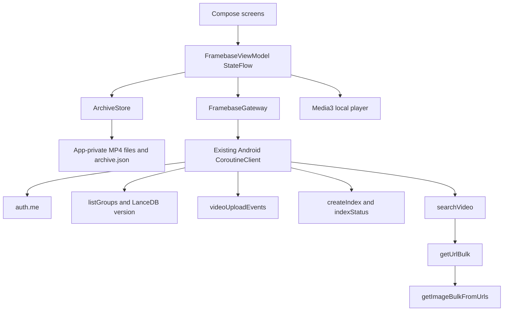

# Framebase Android application — development specification

Date: 2026-09-10

Version: 1.0

## User Specs

- Build a native Kotlin Android version of the Flutter Framebase application in
  `uinterface/sdk_flutter/example/05_framebase`.
- Place the independent Android application in
  `uinterface/sdk_android/examples/05_framebase`.
- Preserve the Flutter app's product behavior and visual hierarchy while using
  Jetpack Compose, the existing VModal Android SDK, and Android-native media and
  lifecycle APIs.
- Treat the Flutter implementation, tests, screenshots, and bundled media as
  the behavior reference. Treat `uinterface/sdk_android` as the source of truth
  for Kotlin SDK types and callable methods.

------------------------------------------------------------------------

## Scope

The Android app must implement the complete Framebase workflow:

1. Show a local library containing the same three bundled street videos.
2. Import an additional MP4 through Android's document picker.
3. Accept a VModal API key at runtime and authenticate with `auth.me()`.
4. Discover whether the fixed Framebase collection has a ready image index.
5. Upload pending local videos with visible progress and cancellation.
6. Create an image index, poll it to a terminal state, and resume polling a
   persisted pending job.
7. Search video frames with natural language and a focused or loose distance
   cutoff.
8. Resolve matching frame images in bulk, group nearby moments by source video,
   and display them in ranked order.
9. Open a locally stored source video at a returned timestamp and allow seeking
   among other matched moments.
10. Persist non-secret archive state and a bounded operation history.

### Out of scope

- No changes to VModal API routes or the Android SDK public API.
- No Clerk UI, account registration, billing, collection picker, or arbitrary
  collection/stream configuration.
- No remote delete, local video delete, remote playback, background upload,
  WorkManager retry, pagination, audio/ASR search, OCR search, or image-query
  search.
- No API key, signed URL, search response, or downloaded image-byte persistence.
- No visual redesign of Framebase and no reuse of the staged form UI from
  `examples/03_fullapp`.
- No pixel-perfect screenshot tests. Compose semantics and layout tests plus
  manual comparison to the reference screenshots are required.

## Sources of truth and existing components to reuse

### Product and UI behavior

- `uinterface/sdk_flutter/example/05_framebase/lib/main.dart`
  defines navigation, screens, visible copy, colors, spacing, grouped results,
  and playback behavior.
- `uinterface/sdk_flutter/example/05_framebase/lib/data/archive_controller.dart`
  defines archive state, upload/index sequencing, persistence boundaries,
  cancellation, and account-change behavior.
- `uinterface/sdk_flutter/example/05_framebase/lib/data/search_gateway.dart`
  defines collection scope, search filters, timestamp/filename normalization,
  bulk image correlation, and safe error behavior.
- `uinterface/sdk_flutter/example/05_framebase/test/` defines the minimum
  parity cases.
- `uinterface/sdk_flutter/example/05_framebase/readme_assets/` contains the
  visual references for library, results, and playback states.

### Android implementation patterns

- Copy the runtime-key, coroutine ownership, generation-based stale-result
  rejection, upload `Flow`, and deterministic bulk-image join patterns from
  `uinterface/sdk_android/examples/03_fullapp`.
- Copy and adapt `contentUriUploadSource(...)` from `03_fullapp` for document
  metadata and reopenable SDK streams. Framebase additionally copies an
  accepted import into app-private storage before adding it to the archive.
- Use the existing Android SDK `Client.coroutines()` facade. Do not perform SDK
  network work on the main thread and do not construct HTTP requests directly.
- Reuse the same source-project versus isolated-Maven switch, Gradle wrapper,
  dependency verification arrangement, JDK 17 target, compile/target SDK 34,
  and minimum SDK 24 used by `examples/03_fullapp`.
- Reuse its `Coil 2.6.0` byte-array rendering pattern for resolved frame images.
- Use AndroidX Media3 `media3-exoplayer` and `media3-ui` at one pinned version
  for local MP4 playback. Pin `1.3.1` to remain aligned with this example's
  existing compile SDK 34 / AGP 8.4 toolchain, and retain one version variable
  for both artifacts.

### Media reuse

Copy the exact media; do not transcode, rename, or generate replacements:

- `assets/videos/neighborhood_crossing.mp4`
- `assets/videos/downtown_traffic.mp4`
- `assets/videos/evening_junction.mp4`
- `assets/stills/neighborhood_crossing.jpg`
- `assets/stills/downtown_traffic.jpg`
- `assets/stills/evening_junction.jpg`
- `assets/fonts/InstrumentSans.ttf`
- `assets/fonts/OFL.txt`

Copy `MEDIA_SOURCES.md` into the Android example and keep its provenance text
and Pexels links synchronized with the Flutter copy. Package videos and stills
under Android assets without changing their relative `videos/` and `stills/`
paths. Package the TTF as `res/font/instrument_sans.ttf`; retain `OFL.txt` in
the app assets.

## Critical invariants

### One fixed remote scope

Every remote operation must use:

```text
mode:       vid_file
collection: framebase_streets
stream:     street_study
```

Upload, collection-version discovery, index creation, search, and image lookup
must use this same scope. UI state from one authenticated user must never be
shown as uploaded or indexed state for another authenticated user.

### Ranked-hit and frame-image coupling

The ranked search response is the source of truth for result order and metadata.
The bulk image response is a derived lookup. It must not reorder hits, attach an
image to another hit, change the backend count, or become a stable item ID.

The join pipeline is:

1. Preserve each usable search row's order.
2. Build one ordered image lookup candidate per usable row.
3. Call `getUrlBulk(...)` once for the candidate list.
4. Interpret `input_index` against candidate order.
5. Validate indexes, `found`, URLs, duplicates, and bounds.
6. Call `getImageBulkFromUrls(...)` once for accepted locators.
7. Correlate downloaded image content without changing ranked order.
8. Keep a result with missing/invalid image bytes and show its placeholder.

### Local source ownership

Playback always uses an app-private local MP4. Bundled videos are copied from
assets on first use. Imported videos are validated and copied into app-private
storage before their document URI can expire. A server result for a video that
is not stored locally remains visible but cannot open playback.

### Secret and temporary-data boundary

The API key lives only in `MutableApiKeyProvider` memory. Search rows, temporary
image locators, and image bytes live only in ViewModel/UI memory. None may enter
saved instance state, preferences, archive JSON, logs, test snapshots, crash
messages, or accessibility descriptions.



## Data Contract

### `ArchiveClip`

Use a small immutable presentation/state model, updating the list by copy:

| Field | Type | Contract |
| --- | --- | --- |
| `id` | `String` | Stable local ID and bundled filename stem. |
| `title` | `String` | User-facing title. |
| `location` | `String` | `City · qualifier`; library/search show the city portion. |
| `durationSec` | `Double` | Finite, non-negative duration. |
| `assetPath` | `String?` | Relative packaged video asset for bundled clips. |
| `posterAssetPath` | `String?` | Relative still asset; absent for imports. |
| `localPath` | `String?` | App-private copied MP4 path. |
| `uploaded` | `Boolean` | Successful upload for the persisted `accountId`. |
| `bundled` | `Boolean` | Keeps a bundled row restorable even before copying. |

`remoteFilename` is `${id}.mp4`. Filename matching is case-insensitive and
accepts the ID, exact remote filename, or a returned name beginning with
`${id}.`.

The initial records must match Flutter exactly:

| ID | Title | Location | Duration |
| --- | --- | --- | ---: |
| `neighborhood_crossing` | Neighborhood crossing | San Francisco · Daylight | 55.2 s |
| `downtown_traffic` | Downtown traffic | Singapore · Afternoon | 15.8 s |
| `evening_junction` | Evening junction | Mexico City · Dusk | 75.0 s |

Imported IDs use `street_{epoch_milliseconds}`, titles use the document display
name, location is `Imported recording`, `bundled=false`, and `uploaded=false`.

### `ArchiveEvent`

Fields are `title`, `detail`, `isError`, and ISO-8601 `time`. Insert newest
first and retain at most 40. Event detail must contain useful phase/count/timing
information without a key, authorization header, signed URL, raw server body,
or local absolute path.

### `FrameMatch` and `SearchBatch`

`FrameMatch` contains the raw row, normalized filename, normalized 13-digit
timestamp, optional local playback seconds, optional downloaded image bytes,
and optional absolute HTTPS image URL. The URL field is only a fallback for an
absolute URL; the current gateway's relative POST locator is resolved through
`getImageBulkFromUrls(...)` and is never handed directly to Coil.

`SearchBatch` keeps these values independently:

- `matches`: all client-accepted search rows, including rows whose image fetch
  failed;
- `total`: backend `cntTotal`, without rewriting after client filtering;
- `serverMs`: backend `executionTimeMs`;
- `roundTripMs`: time through the search response;
- `imageMs`: bulk URL plus bulk image retrieval time after search.

### Filename normalization

Use the first non-blank field in this order:

```text
filename
filename_sanitized
video_filename
video
source_path
path
title
```

Normalize `/` and `\` and retain only the basename. If these are absent, derive
the name from `item_id` by removing a leading `<stream>-` and trailing
`-<timestamp>`. Reject a row when no usable filename remains.

### Timestamp normalization and playback position

For image lookup, read `ts_unix_13digits`, `ts_unix`, then `timestamp_ms`:

- reject non-numeric, non-finite, and negative values;
- keep the first 13 digits when length is at least 13;
- multiply a 10-digit seconds value by 1000;
- left-pad other shorter integers with zeroes to 13 digits.

For playback, prefer the first finite non-negative numeric value from:

```text
video_time_seconds
timestamp_seconds
time_seconds
start_seconds
offset_seconds
seconds
time_sec
```

Otherwise treat the timestamp field as relative milliseconds only when it is
less than `86_400_000`. Do not interpret epoch-like values as video positions.
Seek only when the result position is at or before the local media duration.

### Search request and cutoff

Call the typed coroutine API with:

```kotlin
client.searches.searchVideo(
    queryText = query,
    mode = "vid_file",
    groupName = "framebase_streets",
    streamName = "street_study",
    limit = 30,
    imageEmbScoreMin = maxDistance,
    versionLancedb = indexVersion,
)
```

The SDK's `SearchRequest` already inserts `search_sources=["image"]`; do not add
a custom payload or duplicate that internal wire contract. Focused mode uses
`maxDistance=0.85`; **Include looser matches** uses `1.5`. Smaller distances
indicate more similar results; distance is not a confidence percentage.
Defensively retain only rows with finite `score <= maxDistance` before image
lookup.

### Bulk image lookup

Build each lookup record with exactly:

```text
mode = vid_file
group_name = framebase_streets
modality = vid_img
stream_name = hit stream_name/stream, otherwise street_study
filename = normalized filename
ts_unix_13digits = normalized timestamp, when available
```

- Skip both bulk calls for an empty candidate list.
- Accept an integer, integral finite number, or numeric string `input_index`.
- If `input_index` is absent, use the response record's bounded position.
- Reject negative/out-of-range/malformed indexes, `found == false`, blank or
  invalid locators, and duplicate indexes; first valid record wins.
- Accept HTTPS URLs and relative locators whose path is
  `/api/external/v1/image/get_image`.
- Preserve partial successes and keep a placeholder for unresolved frames.
- Base64 decode failures affect only their corresponding result cards.

### Index lifecycle

Call the typed coroutine SDK:

```kotlin
client.indexes.createIndex(
    mode = "vid_file",
    groupName = "framebase_streets",
    streamName = "street_study",
    reProcess = true,
)
```

The SDK inserts `index_type=vid_img_emb` and `modality=vid_img_emb`; do not
recreate those fields. Persist the returned non-blank job ID before polling.
Poll `indexStatus(jobId)` every four seconds for at most 120 attempts.

Successful terminal values are `success`, `succeeded`, `done`, `completed`, and
`ok`. Failed values are `failed`, `failure`, `error`, `cancelled`, and
`canceled`, case-insensitively. Stopping local polling does not cancel the
server job. Keep `pendingJobId` so the user can resume. On success, refresh
`listGroups("vid_file")`, store the latest numeric LanceDB version for the fixed
collection in memory, clear the pending job, then save.

### Local persistence

Use `android.util.AtomicFile` under an app-private `filesDir/framebase/` folder.
Serialize writes so frequent progress/history changes cannot race. Persist:

```text
clips
pendingJobId
accountId
events (maximum 40)
```

Do not persist `indexVersion`; discover it after each successful connection.
Do not persist API key input/provider, connection state, active query, search
batch, image URLs/bytes, upload handles, player state, or coroutine jobs.

On load, discard a non-bundled clip whose `localPath` no longer exists. Restore
the three bundled clips if decoding fails or no valid clips remain. If a newly
authenticated non-blank `userId` differs from persisted `accountId`, set every
clip's `uploaded=false`, clear `pendingJobId` and history, then save under the
new account.

## State and lifecycle contract

`FramebaseViewModel` owns one immutable `StateFlow<FramebaseUiState>`. Compose
collects it with `collectAsStateWithLifecycle()`.

State must make these conditions distinct:

- initializing local archive;
- disconnected, connecting, connected without index, and search-ready;
- uploading with determinate or indeterminate progress;
- creating/polling an index with phase text;
- stopped polling with a resumable pending job;
- searching and canceling search;
- initial suggestions, no accepted matches, grouped matches, and global error;
- playback loading, ready, playing/paused, and local-open failure.

Keep separate ViewModel jobs/generations for preparation and search. Editing the
query, changing cutoff mode, disconnecting/replacing the credential, importing
a video, starting upload/index work, or clearing the ViewModel invalidates the
current search immediately. A canceled or stale generation cannot publish
results or leave the UI busy.

Collect `videoUploadEvents(...)` for one pending clip at a time. Mark a clip
uploaded only after `VideoUploadEvent.Completed` confirms an uploaded response.
Cancellation keeps already completed uploads and cancels the current SDK upload
through Flow collection cancellation.

`onCleared()` cancels preparation/search work and clears and closes the API key
provider/client. The playback sheet releases its Media3 player on disposal. The
application must not hold an `Activity` in the ViewModel or repository.

## Screen specification

### Theme and common visual tokens

- Force the same light presentation as the Flutter reference.
- Font: Instrument Sans.
- Background/paper: `#ECE9E2`.
- Primary text/ink: `#252C29`.
- Accent/rust: `#AA4F2D`.
- Secondary text: `#706F67`.
- Search field: `#DFDCD4`.
- Use edge-to-edge drawing with dark status/navigation icons and safe-inset
  padding.
- Toolbar and floating search dock may use a subtle blur when supported. A
  translucent color fallback must preserve text contrast when blur is absent.
- Add semantic labels/test tags to every primary action, video card, result
  moment, modal close action, playback control, and progress/cancel action.
- Support 320 dp width without overlap and Android font scale 1.8 without
  clipped primary actions or inaccessible content.

### Library screen

- Transparent/frosted top app bar with Framebase mark, title **Framebase**, add
  icon, and overflow menu.
- Header row: **Street footage** and `<N> videos`.
- One 1.8:1 rounded poster card per clip in archive order. Overlay duration at
  top-right; title and city at bottom-left; play control at bottom-right.
- Imported videos without a still use a neutral movie placeholder.
- Tapping any locally available card opens playback at the beginning.
- Add icon launches `OpenDocument` for `video/mp4`. Accept one playable,
  non-empty MP4 smaller than or equal to 100 MiB, copy it into app-private
  storage, read duration with Android media metadata, add it to the library,
  invalidate search, persist, and show the same success/failure copy as Flutter.
- Overflow items, in order: **Search settings**, **Prepare videos for search**,
  **Sync history**.
- While preparation is active, show one work status block below the cards.
- When connected without an index, show **Prepare videos for search**. When an
  imported clip is pending in an otherwise ready archive, show **Prepare added
  videos**.
- Bottom floating dark search dock reads **Search your videos**, with search
  and forward icons. It stays above gesture/navigation insets and opens Search.
- Do not add dashboard labels, collection badges, connection chips, a permanent
  navigation bar, or raw SDK metrics to this screen.

### Search settings bottom sheet

- Title **Search settings** and connected/disconnected explanatory copy.
- Password field **API key** with suggestions, autocorrect, autofill, and
  personalized learning disabled where Android APIs allow.
- Clear the visible input before authentication starts.
- **Connect** authenticates through `auth.me()`, then discovers the collection
  version. Close the sheet only on success.
- When connected, show **Disconnect**. Disable connect/disconnect during active
  connection or preparation work.
- Replacing a client closes the previous client after the new one succeeds.
- Error text uses sanitized user messages and never echoes the submitted key.

### Prepare confirmation and work state

- Opening Prepare while disconnected first opens Search settings.
- If a pending job exists, immediately resume polling without another upload
  confirmation.
- Otherwise show **Prepare videos for search?**. State either that `<N> videos`
  will upload or that the existing videos' visual index will rebuild.
- Actions: **Cancel** and **Prepare**.
- Preparation uploads each pending clip sequentially, then creates one index.
- Work status shows phase text, a determinate upload bar when total bytes are
  known, and **Cancel** before job creation or **Stop waiting** afterward.
- Show resumable/terminal outcomes through notice text and Sync history.

### Search screen

- Top area is a rounded search bar with back button, editable query, search or
  cancel icon, and overflow options. Hint: **Describe a moment**.
- Editing text clears current results. Keyboard search and the icon run the same
  action. Hide the keyboard when submitting.
- If disconnected, search opens Search settings. If connected without a ready
  index, it starts the Prepare flow and does not send search prematurely.
- Before the first search show **Try a search** and these suggestions:
  - People crossing the street
  - A bus on a city street
  - Cars at an intersection
- Options bottom sheet contains **Include looser matches** and **Search
  details**. Changing the switch invalidates existing results.
- Show a thin progress bar while connecting or searching.
- If accepted matches are empty, show **No matching moments**, **Try a different
  description.**, and **Include looser matches** when focused mode is active.
- Group results by normalized filename in first-seen relevance order. Within
  each video, drop a later result when it is less than six seconds from an
  already retained moment with known time.
- Group header shows the local clip title and city. For an unknown server video,
  use its filename and **Not stored on this device**.
- Use two columns below 600 dp and three at/above 600 dp; tiles are 16:10 with
  10 dp gaps. Initially show at most two moments per video. Add **Show N more
  moments** / **Show fewer moments** when needed.
- Result tiles show image bytes or a neutral placeholder and a bottom-right time
  badge when playback seconds are known.
- Tapping a known local video opens playback at the match time with all retained
  moments for that video. Tapping an unknown source shows **This video is not
  stored on this device.**

### Search details bottom sheet

Before search, show **Run a search first.** After search, show:

```text
Server results: <total>
Within distance filter: <matches.size>
Search request: <roundTripMs> ms
Server execution: <serverMs> ms
Frame retrieval: <imageMs> ms
```

Also explain: **Nearby frames from the same video are combined in the results.
Distance is similarity, not confidence.** Do not show these metrics on result
cards or the library screen.

### Playback bottom sheet

- Use a large, safe-area, scrollable Material 3 modal bottom sheet.
- Header shows clip title, city, and close action.
- Initialize a Media3 `ExoPlayer` from the app-private MP4 and seek to the
  selected result before presenting ready controls.
- Video uses its native aspect ratio, with 16:9 while loading. Show poster plus
  progress while initializing and **This video could not be opened.** on error.
- Overlay a dark rounded control row: play/pause, seek slider, and
  `<position> / <duration>` in `MM:SS` with tabular figures.
- When more than one retained moment exists, show a horizontal **Other moments**
  list. Tapping a tile seeks to it. Highlight the tile within three seconds of
  the current position using the accent border.
- Release the player on sheet disposal. Do not continue audio after dismissal.

### Sync history screen

- Standard back app bar titled **Sync history**.
- Show active work state first when preparation is running.
- Empty state: **No uploads or searches yet.**
- Otherwise show newest-first rows with success/error icon, title, and detail.

## Error and failure behavior

- Authentication failures: **Authentication failed. Check your API key and beta
  access.**
- Missing/unreadable local MP4: **The local video could not be read. Import it
  again.**
- Import validation: **Choose a playable MP4 smaller than 100 MB.**
- Other SDK/network failures: a bounded, sanitized message that contains no
  response body, token, URL query, or local path.
- A malformed upload response cannot mark a clip uploaded.
- A blank index job ID is a failure and must not enter polling.
- A failed terminal job clears the persisted pending job and records an error.
- A poll timeout leaves the job resumable and displays **Still processing. Use
  Resume to check the server job again.**
- Bulk image partial failures preserve successful siblings and placeholders.
- Archive decode/write failure must not prevent the bundled library from
  opening or cancel active network work.
- No exception is caught merely to hide a broken dependency or programming
  error. Error conversion belongs at repository/ViewModel boundaries.

## List of potential failure issues

- The app copies the Flutter request maps instead of using Android SDK models,
  then drifts from fixed image-search/index wire fields.
- `input_index` is joined to raw search rows after a row was filtered, causing
  a frame to display another hit's filename or playback timestamp.
- An image response is partial, duplicated, out of order, malformed, or has
  invalid base64, and one bad record clears every result.
- A relative POST-only image locator is passed to Coil as an ordinary GET URL.
- An epoch timestamp is interpreted as a local playback offset and seeks beyond
  media duration.
- A query/key/account/import/cutoff change races with an old search and publishes
  stale signed locators into the new screen state.
- Upload cancellation marks the active file complete or loses already completed
  files.
- Stopping index polling is treated as server-job cancellation, so the pending
  job ID is discarded and cannot resume.
- Archive writes overlap and truncate JSON, or persistence failure cancels live
  SDK work.
- A document URI is saved directly and becomes unreadable after process death
  instead of being copied to app-private storage.
- Bundled video bytes are fully buffered for every upload rather than streamed
  from a reopenable app-private file.
- A Media3 player or callback survives sheet disposal and leaks the Activity or
  continues playback.
- Nested lazy grids or fixed-height text overflow at 320 dp or large font scale.
- Media3 artifacts are pinned independently, violate dependency verification,
  or force an unrelated Android toolchain upgrade.
- Copying the binary media without its license/provenance file loses required
  attribution context or silently creates divergent fixtures.

------------------------------------------------------------------------

## List of files to create or change

- `uinterface/sdk_android/examples/05_framebase/settings.gradle.kts` — define
  the app and preserve source-project/isolated-Maven SDK selection.
- `uinterface/sdk_android/examples/05_framebase/build.gradle.kts` — reuse the
  Android/Kotlin plugin pins from `03_fullapp`.
- `uinterface/sdk_android/examples/05_framebase/gradle.properties` and Gradle
  launcher/wrapper files — reuse reviewed Android example settings and wrapper.
- `uinterface/sdk_android/examples/05_framebase/app/build.gradle.kts` — Compose,
  lifecycle, Coil, Media3, test dependencies, asset roots, SDK dependency, and
  Java/Kotlin 17 configuration.
- `uinterface/sdk_android/examples/05_framebase/app/src/main/AndroidManifest.xml`
  — launcher activity, Framebase label/theme, and INTERNET permission only.
- `uinterface/sdk_android/examples/05_framebase/app/src/main/res/font/instrument_sans.ttf`
  — exact licensed reference font.
- `uinterface/sdk_android/examples/05_framebase/assets/` — exact reference
  videos, stills, and font license.
- `uinterface/sdk_android/examples/05_framebase/MEDIA_SOURCES.md` — synchronized
  media provenance.
- `uinterface/sdk_android/examples/05_framebase/app/src/main/kotlin/com/vmodal/sdk/examples/framebase/MainActivity.kt`
  — Compose host, edge-to-edge setup, fixed light Framebase theme, ViewModel.
- `uinterface/sdk_android/examples/05_framebase/app/src/main/kotlin/com/vmodal/sdk/examples/framebase/FramebaseModels.kt`
  — archive/event/search/state models and pure normalization/grouping helpers.
- `uinterface/sdk_android/examples/05_framebase/app/src/main/kotlin/com/vmodal/sdk/examples/framebase/ArchiveStore.kt`
  — atomic JSON state and app-private media copy.
- `uinterface/sdk_android/examples/05_framebase/app/src/main/kotlin/com/vmodal/sdk/examples/framebase/FramebaseGateway.kt`
  — coroutine SDK calls and deterministic search/image pipeline.
- `uinterface/sdk_android/examples/05_framebase/app/src/main/kotlin/com/vmodal/sdk/examples/framebase/FramebaseViewModel.kt`
  — state machine, jobs, persistence, upload/index orchestration, search
  invalidation, and cleanup.
- `uinterface/sdk_android/examples/05_framebase/app/src/main/kotlin/com/vmodal/sdk/examples/framebase/FramebaseScreen.kt`
  — library, search, connection, prepare, history, detail sheets, and reusable
  cards.
- `uinterface/sdk_android/examples/05_framebase/app/src/main/kotlin/com/vmodal/sdk/examples/framebase/PlaybackSheet.kt`
  — Media3 player ownership and moment seeking.
- `uinterface/sdk_android/examples/05_framebase/app/src/test/kotlin/com/vmodal/sdk/examples/framebase/FramebaseMappingTest.kt`
  — pure data-contract tests.
- `uinterface/sdk_android/examples/05_framebase/app/src/test/kotlin/com/vmodal/sdk/examples/framebase/FramebaseViewModelTest.kt`
  — fake-gateway state/cancellation and persistence-boundary tests.
- `uinterface/sdk_android/examples/05_framebase/app/src/androidTest/kotlin/com/vmodal/sdk/examples/framebase/FramebaseScreenTest.kt`
  — Compose navigation, state, narrow/wide, and accessibility checks.
- `uinterface/sdk_android/examples/05_framebase/app/src/androidTest/kotlin/com/vmodal/sdk/examples/framebase/PlaybackSheetTest.kt`
  — player seam/seek selection Compose behavior without decoding a network
  resource.
- `uinterface/sdk_android/examples/05_framebase/README.md` — setup, workflow,
  architecture, credential boundary, media provenance link, validation, and
  troubleshooting.
- `uinterface/sdk_android/examples/test.sh` — add a namespaced Framebase live
  dispatcher only if a deterministic live workflow test is implemented.

Keep related Kotlin files midsize. Reuse pure functions rather than creating a
new class for every small mapping step. Do not change SDK source unless an
offline reproducer proves that the documented existing SDK contract is broken.

## Implementation steps

### P0 — Scaffold and freeze the reference

- Copy the independent Gradle project structure and source/Maven dependency
  switch from `03_fullapp`; set root project/application/package names to
  Framebase.
- Copy the exact media, font, license, and provenance files.
- Add Compose/lifecycle/Coil dependencies matching `03_fullapp`; add the two
  Media3 playback artifacts at one pin.
- Build an empty themed activity before adding workflow code.

#### Test cases

- `:app:assembleDebug` succeeds with SDK source mode.
- The APK contains all three MP4s, stills, and the Instrument Sans font.
- No API credential or generated environment value is packaged.
- App starts on API 24 and renders edge-to-edge at 320 dp width.

### P1 — Implement pure models, persistence, and local media

- Add exact bundled clip definitions and pure filename, timestamp, duration,
  event-bound, and nearby-moment helpers.
- Implement `AtomicFile` archive read/write and deterministic fallback.
- Copy bundled videos lazily and imported videos eagerly to app-private files.
- Validate size, MIME/extension, readability, and duration before publishing an
  imported clip.

#### Test cases

- Bundled records and filename matching equal the Flutter values.
- Imports produce unique IDs and cannot retain an external URI as playback
  state.
- A missing imported file is removed at restore; bundled entries remain.
- Invalid/corrupt JSON restores defaults.
- Writes never include key/search/image fields and keep only 40 events.
- Duration formatting handles `0`, `55.2`, `75`, non-finite, and large values.

### P2 — Implement gateway contracts with fake transport coverage

- Configure `Client` with `MutableApiKeyProvider` and use `client.coroutines()`.
- Implement connect/version discovery, sequential upload Flow, index calls, and
  the full search/image mapping contract.
- Copy deterministic candidate/join logic from `03_fullapp`, then add the
  Framebase cutoff, placeholder retention, playback-time parsing, and timing
  metrics from Flutter.
- Expose a small gateway interface so ViewModel tests use fakes and never make
  live calls.

#### Test cases

- Connect calls identity then groups and selects the greatest `vN` for the
  fixed collection.
- Typed SDK requests carry exact fixed scope/cutoff/version values.
- Every filename alias, `item_id` fallback, and separator normalizes correctly.
- Relative milliseconds map to playback seconds; epoch-like values do not.
- Out-of-order, partial, duplicate, string/numeric/missing, negative, and
  out-of-range `input_index` cases never cross-associate a hit and image.
- Client cutoff drops an over-threshold row before image calls but preserves
  backend total.
- Empty results make no image request; corrupt base64 preserves a placeholder.
- Closing the gateway clears the provider and closes the client.

### P3 — Implement ViewModel workflow and cancellation

- Restore the archive on construction and publish one immutable UI state.
- Implement connect/disconnect with account-bound uploaded-state reset.
- Implement import, sequential upload, index creation, four-second polling,
  stop/resume, search, history, and sanitized errors.
- Use injectable delay/clock/store/gateway seams where needed for deterministic
  JVM tests; do not add a dependency-injection framework.

#### Test cases

- A failed/replaced key never appears in state or logs.
- Completed uploads survive cancellation; the active upload remains pending.
- Stopping after job creation retains a resumable job ID.
- Success refreshes version; failure clears the job; timeout remains resumable.
- Account change resets uploaded flags/job/history exactly once.
- A newer search/query/cutoff/key/import/preparation state rejects late output.
- `onCleared()` cancels jobs and clears credentials.
- Persistence failure does not cancel upload/search work.

### P4 — Implement library, settings, preparation, and history UI

- Build the fixed light theme, brand mark, video cards, bottom search dock,
  overflow actions, settings sheet, prepare dialog/status, import picker, and
  history screen.
- Keep credentials in ordinary non-saveable Compose state and clear input on
  submit.
- Use a single vertical scroll owner per screen and safe inset padding.

#### Test cases

- Library starts with three rows and no dashboard/status decoration.
- Add/overflow/search actions have labels and open correct UI.
- Runtime key field is masked and not restored after recreation.
- Disconnected Prepare routes through settings; connected Prepare confirms.
- Work cancel label changes to **Stop waiting** after job creation.
- Empty and populated history states render correctly.
- 320 dp and font scale 1.8 remain scrollable without overlap.

### P5 — Implement grouped search UI

- Add search bar, suggestions, loose-match option, details sheet, states, group
  headers, adaptive moment grids, expansion, placeholders, and local-source
  handling.
- Keep ranking and grouping in pure helpers; UI only renders computed groups.

#### Test cases

- Initial state shows three suggestions and no result metrics.
- Query edit and cutoff toggle immediately clear old results.
- Search/cancel icon and keyboard submit use the same state transition.
- Empty focused search offers looser matching.
- Results retain first-seen video order, collapse moments under six seconds,
  and initially show two tiles per video.
- Expansion is per video and changes correct button copy.
- Grid is two columns below 600 dp and three columns at/above it.
- Unknown videos remain visible and show the local-playback snackbar.
- One image failure shows one placeholder without removing siblings.

### P6 — Implement playback sheet

- Add a small player abstraction around Media3 so timing/seek behavior can be
  tested without relying on a device decoder.
- Initialize from local path, apply initial seek safely, render controls, and
  release deterministically.

#### Test cases

- Library playback starts at zero; result playback seeks to returned seconds.
- Out-of-duration and epoch-like positions do not seek.
- Play/pause and slider update the same player.
- Other-moment tap seeks and active border follows the three-second rule.
- Close/dispose releases the player and stops playback.
- Loading and open-failure states retain title, city, close action, and poster.

### P7 — Documentation and final verification

- Write the Android README from final behavior and synchronize media provenance.
- Compare all primary screens interactively to the three Flutter reference
  screenshots on a phone-size emulator/device.
- Run offline SDK/example tests, the debug build, Compose instrumentation, and
  a manual authenticated workflow.
- Add the live test dispatcher only when it can use the repository's existing
  environment setup and redact all credentials/temporary URLs.

#### Test cases

- README commands work from their stated directories.
- Neighboring `sdk_android` docs do not contradict the new example.
- No stale references claim Framebase is Flutter-only.
- No key, bearer token, signed locator, or app-private absolute path appears in
  source fixtures, logs, docs, or test output.

------------------------------------------------------------------------

## Test Critical List

- `FramebaseMappingTest.kt` — highest-priority protection for search-hit/image
  association, filename/timestamp parsing, cutoff, grouping, and counts.
- `FramebaseViewModelTest.kt` — state invalidation, cancellation, account
  coupling, resumable index jobs, persistence boundary, and credential cleanup.
- `FramebaseScreenTest.kt` — navigation, initial/empty/result states, expansion,
  adaptive layout, large text, and accessibility semantics.
- `PlaybackSheetTest.kt` — initial seek, moment switching, and deterministic
  release through a fake player.
- Existing `uinterface/sdk_android/src/test/kotlin/com/vmodal/sdk/` tests — prove
  the app did not require alternate SDK request or route behavior.
- Manual API 24+ device/emulator workflow — required for document provider,
  codec/playback, keyboard/insets, real upload/index/search, and visual parity.

## Test for Data Contract List

- Bundled archive fixture — exact IDs, names, locations, durations, asset paths,
  order, and initial flags.
- Persisted archive fixture — supported fields only, 40-event bound, corrupt
  JSON fallback, missing imported-file cleanup, and account ownership.
- Search request fixture — fixed mode/collection/stream, image-only SDK wire
  behavior, limit 30, cutoff, and LanceDB version.
- Search row fixtures — every filename alias, `item_id` fallback, slash styles,
  blank values, score cutoffs, relative milliseconds, seconds, and epoch time.
- Bulk URL fixtures — ordered, out-of-order, partial, duplicate, missing,
  numeric/string/malformed indexes, false `found`, blank/invalid/relative/HTTPS
  locators.
- Bulk image fixtures — indexed and URL-correlated records, corrupt/missing
  base64, and successful siblings.
- Grouping fixture — interleaved filenames, known/unknown timestamps, boundaries
  just below and at six seconds, first-seen group order, and retained hit order.
- Upload/index fixtures — progress with/without total bytes, completion,
  cancellation, blank job ID, all terminal aliases, timeout, and resume.
- Playback fixture — zero, valid match, unknown time, negative, epoch-like, and
  beyond-duration positions.
- Secret-boundary fixture — serialized JSON, UI state, logs, and errors contain
  no credential, bearer header, signed locator, response body, or local path.

## Verification commands

Run repository setup without creating a new environment:

```bash
source ./isetup_env.sh
export PYTHONPATH="$(pwd)"
```

Then run:

```bash
cd uinterface/sdk_android
./gradlew --no-daemon test

cd examples/05_framebase
./gradlew --no-daemon :app:testDebugUnitTest :app:assembleDebug
./gradlew --no-daemon :app:connectedDebugAndroidTest
```

The connected task requires an unlocked API 24+ emulator/device. JVM and
Compose tests must use fake gateway responses and local data; they must not
need an API key or temporary signed URL.

For final manual validation:

1. Start from a clean app install and confirm the three reference library cards.
2. Open settings, authenticate with a runtime key, and verify the key field
   clears and the collection version is discovered.
3. Prepare all videos; cancel during one upload, resume, then stop and resume
   index polling.
4. Search each reference query in focused mode and verify group order, images,
   times, expansion, and search details.
5. Search an absent subject, then enable loose matches and verify the cutoff
   difference without presenting distance as confidence.
6. Open a result and confirm initial timestamp, play/pause, slider, other-moment
   seeking, active border, and release on dismissal.
7. Import a valid MP4 and reject an oversized or unreadable file.
8. Restart the app: local library/history/pending job survive; credential and
   search images do not.
9. Authenticate as a different user and confirm upload/job/history state resets.
10. Repeat at 320 dp width, at/above 600 dp width, font scale 1.8, and with
    TalkBack focus over all primary controls and media tiles.

## Acceptance criteria

- Android Framebase is a standalone API 24+ Jetpack Compose example that builds
  against both the local SDK project and the isolated Maven candidate path.
- Library, search, settings, prepare/progress, history, and playback match the
  Flutter reference's information hierarchy, visible copy, and core styling.
- The same three licensed media files, stills, font, and provenance ship with
  the example without silent transformations.
- All network work uses the existing Android coroutine SDK and one fixed
  collection/stream contract.
- Upload progress/cancellation, asynchronous index polling/resume, and
  collection-version discovery work without blocking the main thread.
- Bulk frame retrieval cannot cross-associate search metadata and image content;
  malformed and partial responses preserve safe ranked placeholders.
- Focused/loose cutoff, six-second grouping, two-to-three-column layout,
  expansion within each video, and local timestamp playback match the Flutter
  behavior.
- App-private archive state survives restart while keys, search responses,
  signed locators, image bytes, and player state never persist.
- Account changes cannot reuse another user's uploaded/index/history state.
- Unit tests, debug build, connected Compose tests, and the manual authenticated
  workflow pass, with missing emulator/live credentials reported explicitly.

------------------------------------------------------------------------

## Implementation Order

1. P0: scaffold the independent project and verify copied assets/toolchain.
2. P1: lock local models, archive persistence, and media ownership with tests.
3. P2: lock SDK request/response and image-correlation contracts with fakes.
4. P3: implement lifecycle-safe ViewModel orchestration and cancellation.
5. P4: build library/settings/prepare/history UI on stable state contracts.
6. P5: add grouped search UI and adaptive result behavior.
7. P6: add Media3 playback and seek behavior.
8. P7: synchronize documentation and run offline, device, and live validation.
