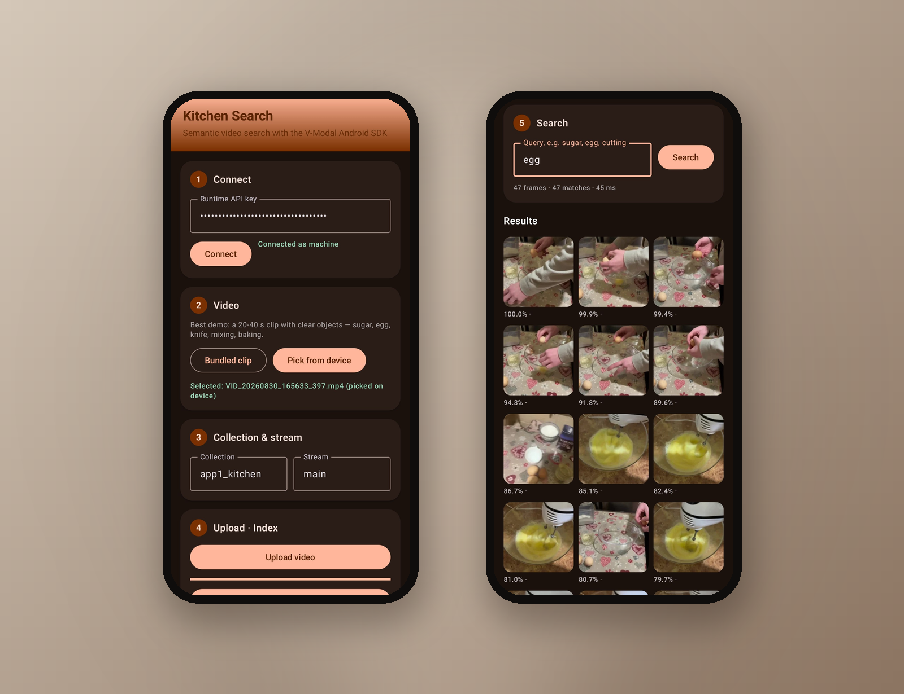

# app1 — Kitchen Search

A small, polished demo of the V-Modal Android SDK: upload a short real-world
video, build its image index, and search it with plain text. Results are shown
as a grid of ranked frames with scores — the same pattern as the
"Words from video" demo: one text query per object or action, top frames
rendered as cards.

## Screens

Left: workflow (connect, video, collection, upload & index).
Right: search results — query `egg`, 47 ranked frames in ~45 ms, top frames
are the egg-cracking moments.



## Flow

1. **Connect** — paste a runtime API key (never stored in code or config) and
   resolve `auth.me`.
2. **Video** — use the bundled `asset/kitchen.mp4` clip, or pick any video
   from the device (best: 20–40 s with clear objects — sugar, egg, knife,
   mixing, baking).
3. **Upload · Index** — upload into your own collection/stream, create the
   `vid_img_emb` index, refresh status until ready.
4. **Search** — type a word (`sugar`, `egg`, `cutting`, `mixing`) and get a
   ranked grid of frames with scores and latency.

Note: score thresholds are set to 0, so the server always returns the top
frames for a query — even a query that matches nothing returns the closest
frames. Judge semantic quality by how the *order* of frames changes between
different queries.

## Run

Open this folder (`examples/app1`) as a project in Android Studio and run
`app` on a device or emulator, or from the terminal:

```
cd examples/app1
gradle :app:assembleDebug
```

Requires JDK 17 and an Android SDK (compileSdk 34). The SDK module is
included from the repository root, same as `examples/03_fullapp`.

## Bundled video

`asset/kitchen.mp4` is the bundled demo clip. Replace it with your own short
clip (your own footage keeps licensing trivial) — the app also offers
"Pick from device", so any video on the phone works without rebuilding.

## Notes

- The API key is entered at runtime only; nothing is persisted.
- Defaults (`app1_kitchen` / `main`) are just suggestions — use any
  collection and stream your key may create.
